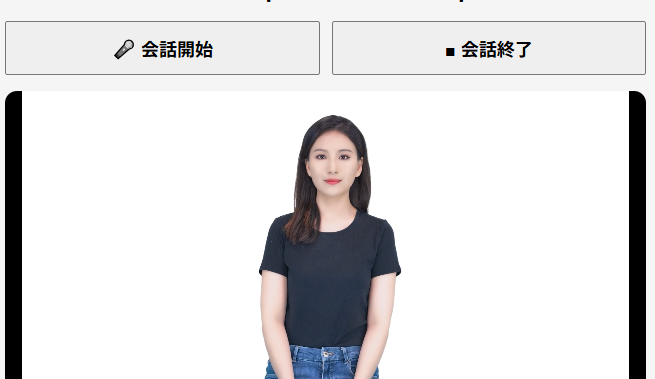

# Azure AI Speech Avatar Sample



Azure AI Speech Avatar を利用して、リアルタイムで会話できる Web アプリケーションのサンプルです。

本サンプルでは、以下の流れで動作します。

1. ブラウザからマイク音声を取得（Speech to Text）
2. LLMへ質問を送信
3. LLMの回答を取得
4. Avatar が回答内容を発話（Text to Speech）
5. Avatar の映像・音声を WebRTC でブラウザへ配信

本リポジトリは、Zenn 記事で紹介しているサンプルコードになります。

---

# システム構成

```
Browser
    │
    │ Speech SDK
    ▼
Speech Service (STT)
    │
    ▼
LLM API
    │
    ▼
Speech Avatar (TTS)
    │
 WebRTC
    │
    ▼
Browser
```

---

# ディレクトリ構成

```
.
├── main.py
├── config.py
├── templates
│   └── index.html
├── static
│   └── js
│       ├── app.js
│       ├── stt.js
│       ├── avatar.js
│       ├── llm.js
│       ├── config.js
│       └── microsoft.cognitiveservices.speech.sdk.bundle.js    # ローカルに入れておく場合は手動で配置する
│
├── requirements.txt
└── README.md
```

---

# 動作環境

- Python 3.13
- Flask
- Azure AI Speech
- Azure AI Speech SDK
- Google Chrome

---

# 必要な Azure リソース

本サンプルでは Speech Service を2つ利用しています。

|用途|価格プラン|
|----|----------|
|Speech to Text|Free(F0) または Standard(S0)|
|Avatar(Text to Speech)|Standard(S0)|

> **注意**
>
> Avatar は **Standard(S0)** でのみ利用できます。

---

# Avatar 対応リージョン

Avatar は利用できるリージョンが限定されています。

例)

- East US 2
- West US 2
- Southeast Asia

詳細は Microsoft の公式ドキュメントを参照してください。

---

# 環境変数

以下の環境変数を設定してください。

|環境変数|説明|
|---------|----|
|STT_SPEECH_KEY|Speech(STT) のキー|
|STT_SPEECH_REGION|Speech(STT) のリージョン|
|TTS_SPEECH_KEY|Avatar用 Speech のキー|
|TTS_SPEECH_REGION|Avatar用リージョン|

|LLM_API_URL|LLMエンドポイント|

※ 使用する LLM に合わせて変更してください。
---

# LLM API

本サンプルでは、

```
POST /api/chat
```

を呼び出すことを想定しています。

リクエスト

```json
{
    "message":"こんにちは"
}
```

レスポンス

```json
{
    "answer":"こんにちは。今日は何をお手伝いできますか？"
}
```

LLM の種類は問いません。

Azure OpenAI
OpenAI API
Claude
Gemini

など、任意の API を利用できます。

---

# CORS

LLM API を別ドメインへ配置する場合は、
ブラウザから直接アクセスするため CORS の許可が必要になります。

例)

```
Access-Control-Allow-Origin
```

を適切に設定してください。

---

## Speech SDK

Speech SDK は Microsoft の公式サイトから取得してください。

https://aka.ms/csspeech/jsbrowserpackageraw

ダウンロードした

microsoft.cognitiveservices.speech.sdk.bundle.js

を

static/js/

へ配置してください。
---

# 実行方法

Python パッケージをインストールします。

```bash
pip install -r requirements.txt
```

アプリケーションを起動します。

```bash
python main.py
```

ブラウザでアクセスします。

```
http://localhost:5000
```

---

# App Service へデプロイする場合

Azure App Service でも動作します。

ただし、VNet Integration を利用する場合は注意が必要です。

Avatar は TURN サーバーへ接続するため、

```
https://<region>.tts.speech.microsoft.com
```

へアクセスできる必要があります。

Route All を有効にしている場合は、
Azure Firewall や NAT Gateway などを利用して、
インターネットへのアウトバウンド通信を許可してください。

---

# WebRTC について

Avatar は WebRTC を利用してブラウザへ映像・音声を配信しています。

Session Start 時には、

- Relay Token の取得
- RTCPeerConnection の生成
- Avatar セッション開始

を行っています。

---

# 注意事項

本サンプルは学習目的のサンプルコードです。

エラーハンドリングやセキュリティについては、
必要に応じて実装してください。

また、Speech Key などの機密情報は
JavaScript に記載せず、
必ずサーバー側で管理してください。

---

# ライセンス

MIT License